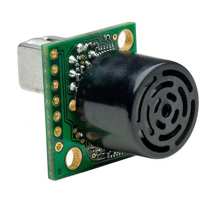

# Sonar
-This repository contains code for using the ultrasonic sensor with a Raspberry Pi, Arduino, and ROS.

The ultrasonic sensors used in this project are the MB1212 I2CXL-MaxSonar-EZ1 as shown in figure 1. They operate on 3 to 5 volts DC, which provides short to long-range detection. This sensor provides range readings with a precise centimeter resolution and can detect objects from 25 cm to 764 cm away at a rate of 10Hz (100 ms). The MB1212 is equipped with a transducer that is used for sending and receiving ultrasonic sound. The time it takes for the ultrasonic sound to hit an object and reflect back is used to calculate the object's distance. More specifically, 𝐷𝑖𝑠𝑡𝑎𝑛𝑐𝑒 = (𝑇𝑖𝑚𝑒 𝑜𝑓 𝑓𝑙𝑖𝑔h𝑡 𝑜𝑓 𝑠𝑜𝑢𝑛𝑑 𝑤𝑎𝑣𝑒) / (2*(Speed of Sound)).

  
Figure 1 MB1212 I2CXL-MaxSonar-EZ1

The communication protocol used with this sensor is the Inter-Integrated Circuit, also known as I2C. This protocol requires two wires, serial data (SDA) and serial clock (SCL), to communicate between the sensor and the master device (Raspberry Pi). The advantage of the I2C communication protocol is that multiple sensors can be connected to the same I2C bus given that each sonar has its own I2C address. Figure 2 shows a diagram of three sonars connected to the same bus [1]. In this project, three ultrasonic sensors are used and are programmed to have addresses 0x70, 0x72, and 0x74, respectively.

  
Figure 2 Multi-Sensor Wiring Schematic

To enable the I2C communication protocol on the Raspberry Pi the I2C-tools package had to be installed on the Ubuntu 18.04 operating system. The python library, smbus2, is used to send commands to the sensor. These commands consist of taking a range reading and reading the last reported range value. Having these two commands in a while loop allows for continuous range readings.
